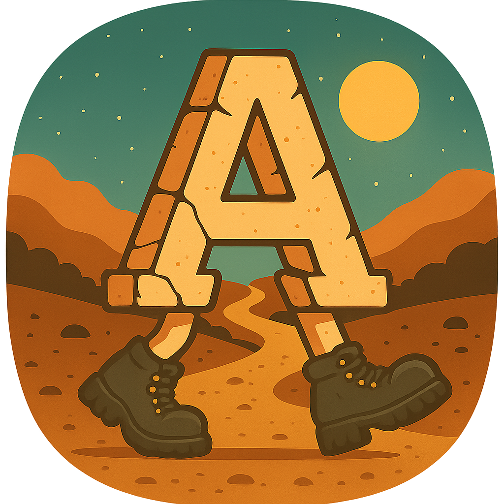

# Amble

<picture>
  <source srcset="amble_logo.png" />
  
</picture>

Data‑first interactive fiction engine and authoring DSL in Rust.

## How It Started

I wanted to learn Rust and thought an 80s‑style parser adventure (think Zork) would be the perfect project. A small game prototype quickly snowballed into a data‑driven engine, a friendly DSL, and tooling to build real adventures.

## What It Is Now

Amble is a data‑first engine that loads worlds from compiled `WorldDef` data (`world.ron`), plus a DSL and compiler that make worldbuilding fast and readable. The repo includes developer tools and a fully playable demo you can run immediately.

## DSL Spotlight

The Amble DSL is designed to read like plain English while staying precise and composable.

- Start with `amble_script/docs/dsl_creator_handbook.md` for the language tour.
- For rich editing, see the [Zed Amble extension](./zed_extension.md) with outlining, references, rename, formatting, diagnostics, and autocomplete.

## Quickstart

### Play Now (prebuilt ZIP)
- Download the appropriate ZIP from Releases.
- Extract and run `amble_engine` (use `amble_engine.exe` on Windows).
- Type `help` in the game REPL for commands. Saves go to `saved_games/`.

### Build & Tinker (Rust toolchain)
1. Install the latest stable Rust toolchain (this repo pins a version in `rust-toolchain`).
2. Clone this repository and `cd` into it.
3. Run the engine with the bundled content:
   `cargo run -p amble_engine`
4. Use `help` in the REPL; saves land in `saved_games/`.

### Author New Content
1. Explore the DSL guides in `amble_script/docs/`—start with `dsl_creator_handbook.md`.
2. Compile the sample DSL to `world.ron`:
   `cargo run -p amble_script -- compile-dir amble_script/data/Amble --out-dir amble_engine/data`
3. Launch the engine to test your changes:
   `cargo run -p amble_engine`
4. Iterate with `amble_script lint …` to catch missing references early.

## Crates in this Repository
- `amble_engine` - loads world data from `world.ron` (plus TOML configs for themes/scoring/help) or a saved state, then runs the game
- `amble_script` - an intuitive, English-like language (DSL) for defining the game world, which compiles into `WorldDef` (RON) used by `amble_engine`
- [`xtask`](../xtask/README.md) - automation helpers for builds, packaging, and the content pipeline

## Optional (but nice!) External Repositories for Developers
- `tree-sitter-amble` - a tree-sitter parser / syntax highlighter for the amble_script DSL
- `zed-amble-ext` - a full-featured extension for the Zed editor with not only syntax highlighting but a language server that supports outlining, references / go to definition, symbol renaming, formatting, diagnostics, autocomplete -- the works.

## Engine Features

- Data-first design so stories live entirely in `.amble` -> `world.ron` (WorldDef) data, not code
- Rooms with conditional description overlays that can adapt to world state and connections that can be conditional, hidden, locked, or remapped entirely during play
- Items support a variety of capabilities (like "ignite" or "smash" or "turn on") and interactions, and can be consumable; items can also be containers and nested to an arbitrary depth.
- NPCs supported with dialogue, trade options (via triggers), moods/states, and movement on either predetermined routes or randomly through a defined area
- Goals / Achievement system to help guide players to important objectives and mark progress
- Configurable point scoring system
- Customizable status effects
- In-game help system for players with built-in help for commands but customizable general help text.
- WorldDef validation plus a placement pass that seeds initial room/NPC/item locations
- Thorough logging of game and engine events enabled throughout
- REPL-style parser with natural language verbs, synonyms, and DEV tools
- Powerful trigger/scheduler system for conditional, delayed, or repeating events
- Flexible flag model with sequence counters and derived logic helpers
- Themeable terminal UI with multiple palettes and optional styling
- Save system (RON full game state snapshots) for restoring worlds mid-adventure
- Comprehensive test suite and CLI harness for fast iteration

## Engine Development / Contributions
- Any ideas / contributions welcome!
- At initial release, I feel like the UI is the weakest point. I tried to encapsulate everything display-related into the view module, hopefully making it easier to create a better TUI without having to modify the engine much.
- Bugs and ideas for enhancements to the engine, demo game, DSL or tooling should be submitted as Issues on GitHub.
