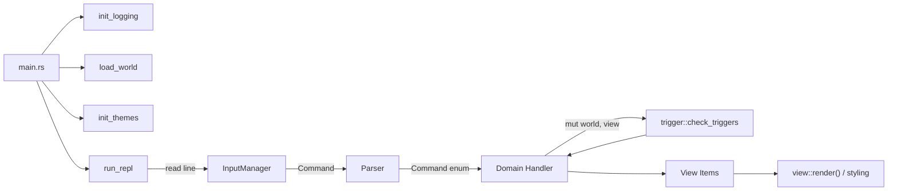

# Amble Engine Overview

This document connects the major components of the engine so new contributors can understand how a command travels through the system, how world state changes, and where to look for specific behaviours. For a few gotchas and some in-depth design notes, see [engine_notes.md](./engine_notes.md); for styling details, see [THEME_SYSTEM.md](./THEME_SYSTEM.md).

---

## 1. Startup and Application Flow

1. **`main.rs`** – Bootstraps logging (`init_logging`), loads world data (`load_world`), initialises themes (`init_themes`), clears the terminal, then calls `run_repl`.
2. **`run_repl` (`repl.rs`)** – Runs the interactive loop:
   - Reads player input via `repl::input::InputManager`.
   - Parses the line into a `Command` (`command::parse_player_command`).
   - Dispatches to the appropriate handler (`repl::movement`, `repl::item`, `repl::system`, etc.).
   - Renders results using the `View` pipeline in `view.rs`.

---

## 2. Turn Lifecycle

Once a `Command` has been accepted, each loop iteration proceeds in a consistent order:

1. **Increment turn** – `world.turn_count += 1` (this is done in individual command handlers so that typos and other actions that shouldn't count as a turn, don't).
2. **NPC movement** – `repl::check_npc_movement` applies movement routes/timing.
3. **Scheduled events** – `repl::check_scheduled_events` drains any events whose `due_turn <= turn_count`, evaluates their conditions, and executes actions (creating tombstones when rescheduled).
4. **Ambient checks** – `repl::check_ambient_triggers` fires “always” triggers and status effects.
5. **Render output** – `view::flush` flushes accumulated `ViewItem`s, styled according to the active theme.

Understanding this order is critical when writing triggers or scheduled actions, as it explains why an event scheduled “in 1 turn” appears immediate (because the turn counter increments before the scheduler runs).

---

## 3. Command Handling Pipeline

- **Parser** (`command.rs`) converts tokenized input into strongly typed `Command` variants.
- **Handlers** (modules under `repl/`) mutate `AmbleWorld` and populate the `View`:
  - `movement.rs` – room transitions, go back, map checks.
  - `item.rs` – take/drop/use logic, container interactions.
  - `npc.rs` – dialogue and trade, integrates with triggers.
  - `system.rs` – help, inventory, goals, theme switching.
  - `dev.rs` – developer-only commands (see §6).
- **Trigger entry points** – most handlers call `trigger::check_triggers` or use helper functions (e.g., `trigger::spawn_item_in_inventory`) to ensure world logic runs via the same pipeline as DSL-authored behavior.

Each handler receives `(&mut AmbleWorld, &mut View)` so state changes and UI output stay co-located and testable.

---

## 4. Trigger and Scheduler Core

- **`trigger::Trigger`** – compiled DSL entities (see `amble_script` crate). Triggers include:
  - Event matchers (e.g., `EnterRoom`, `UseItem`, `Always`).
  - Condition lists (`all`/`any` flattened at load time).
  - Action lists (`show_message`, `spawn_item`, `schedule_in`, etc.).
- **`trigger::check_triggers`** – accepts a slice of `TriggerCondition`s to evaluate after handlers mutate state. Returns the list of fired triggers so the caller can provide fallback messaging if nothing responded.
- **Scheduler** (`scheduler.rs`) – stores `ScheduledEvent`s in turn order. `OnFalsePolicy` determines behavior when conditions fail:
  - `Cancel` – drop event.
  - `RetryAfter { turns }` – enqueue a clone offset by N turns (original slot becomes a tombstone).
  - `RetryNextTurn` – convenience for `RetryAfter { turns: 1 }`.
- **Developer visibility** – `:sched`, `:schedule cancel`, and `:schedule delay` expose queue contents and control during debugging.

---

## 5. World State Anatomy (`AmbleWorld`)

Located in `world.rs`, `AmbleWorld` centralizes mutable state:

- **Player** (`player.rs`) – inventory, current location, flag set, previously visited rooms.
- **Rooms/Items/NPCs** – lookups by string ids (symbols), so DSL tokens map directly to runtime ids.
- **Goals** (`goal.rs`) – active and completed objective tracking.
- **Scheduler** – queued events and ambient timers.
- **History** – movement trail used for `go back`.

Save files (`saved_games/<world>/*.ron`) serialise the entire structure, so loading a save restores flags, scheduled events, and NPC positions exactly.

---

## 6. Rendering and Theming

- **`view.rs`** – Defines `ViewItem` (success/error text, room descriptions, NPC dialogue, etc.) and renders them using the active `GameStyle`.
- **`style.rs` / `theme.rs`** – Apply colors/styles to text. Themes live in `data/themes.toml` and are cached by `theme::ThemeManager`. See [THEME_SYSTEM.md](./THEME_SYSTEM.md) for full details and guidance on creating new palettes.
- **CLI output** – The engine uses `colored` and ASCII control sequences; the REPL clears the screen at startup for a clean slate.

---

## 7. Developer Tooling

- **Logging** – Controlled via environment variables (see the “Debugging Toolkit” section in `amble_script/docs/dsl_creator_handbook.md`). DEV commands emit `warn!` entries so you can audit testing sessions.
- **DEV commands** – Compiled when the `dev-mode` feature flag is enabled (`cargo run -p amble_engine --features dev-mode`). Commands include teleporting, spawning items, manipulating flags, and inspecting the scheduler. Summaries live in `repl/dev.rs` and in the DSL handbook.
- **Tests** – Unit tests sit next to their modules (`#[cfg(test)]`), while integration tests live under `amble_engine/tests`.

---

## 8. Further Reading

- [engine_notes.md](./engine_notes.md) – Historical notes and deeper dives into triggers, flags, spinners.
- [THEME_SYSTEM.md](./THEME_SYSTEM.md) – Theme architecture and customization guide.
- DSL authoring documentation (`amble_script/docs/*`) – Understand how triggers, items, rooms, NPCs, spinners, and goals map into engine structures.
