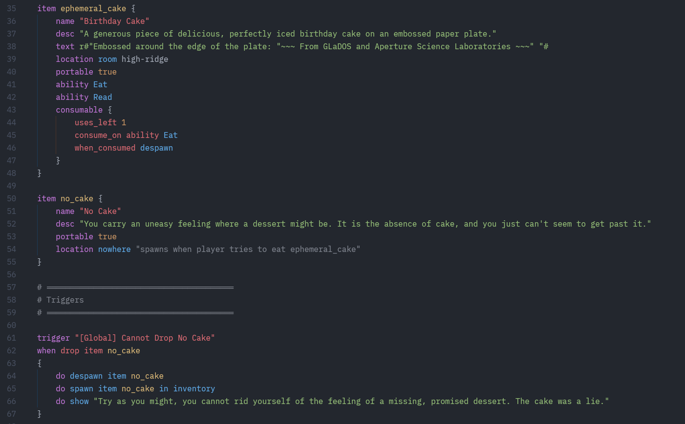

# amble_script

`amble_script` is the domain-specific language, parser, and compiler that powers Amble worlds. It turns human-friendly `.amble` sources into `WorldDef` data (`world.ron`) consumed by `amble_engine`, and ships linting for catching missing references early.

## Highlights

- Pest grammar designed to read like natural narrative prose while staying precise.
- Compiler emits `WorldDef` (RON) for rooms, items, triggers, spinners, NPCs, and goals.
- Linter catches unresolved references, type mismatches, and missing assets early.
- CLI supports compiling single files, entire directories, or lint-only passes.

## Amble DSL Syntax
- one bit of the base game's code for handling a cake item gag can be seen in the screenshot from the Zed editor below



## CLI Usage

```bash
# Compile a single DSL file to world.ron (or print to stdout if omitted)
cargo run -p amble_script -- compile path/to/file.amble --out-world path/to/world.ron

# Compile a directory of DSL files into world.ron expected by the engine
cargo run -p amble_script -- compile-dir amble_script/data/Amble --out-dir amble_engine/data

# Lint files (optionally deny missing references)
cargo run -p amble_script -- lint path/to/file.or.dir --deny-missing
```

The generated `world.ron` bundles all compiled content into a single file for the engine to load.

## Documentation

Read the Creator Handbook and reference materials in `docs/`:

- `amble_script/docs/dsl_creator_handbook.md`
- `docs/README.md` (project overview)

## License

MIT License – see the repository root `LICENSE`.
