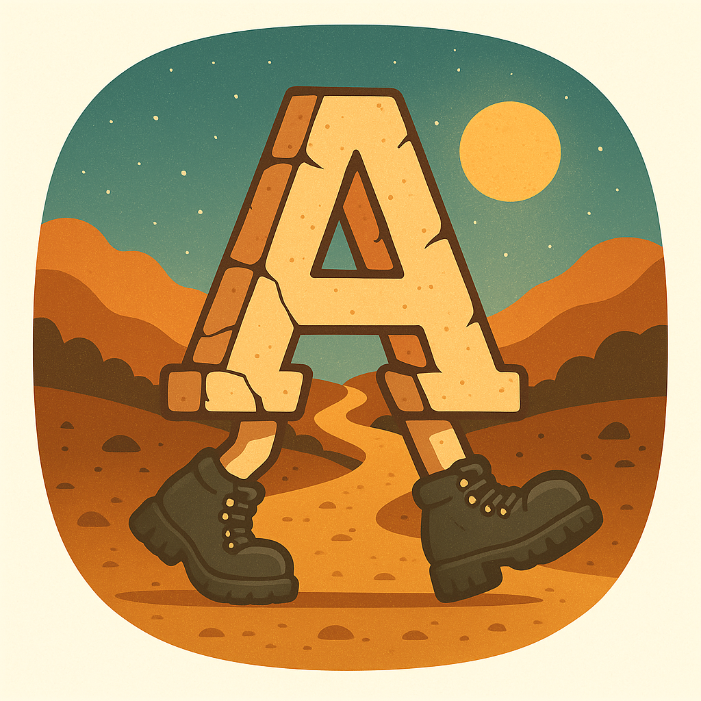

# Amble

## How It Started

I'm a long-term hobbyist developer since the Apple II+ was peak technology, and enjoy learning different languages, over the years including BASIC, 6502 Asm, Pascal, Perl, C++, Python... and I decided I wanted to learn Rust. So, I decided I'd create an 80's style parser game (think Zork) in Rust as a way to start building some Rust chops, and thought it would be fun to pack in as many references to things I like as I could along the way.

## What It Is Now

What started as a simple little game blossomed into a fully data-driven game engine that could be used for building any variety of adventures and a full set of developer tools for game creation, as well as a reasonably sized fully playable demo. It seemed a shame for me to be the only one to ever play or use it.

## Quickstart

### Play the bundled demo
1. Install the latest stable Rust toolchain (the workspace tracks the version in `rust-toolchain`).
2. Clone this repository and change into the workspace directory.
3. Run the engine with the shipped content:
   `cargo run -p amble_engine`
4. Use `help` in the REPL for command assistance. Save games land under `saved_games/`.

### Author new content
1. Explore the DSL guides in `amble_script/docs/`—start with `dsl_creator_handbook.md`.
2. Compile the sample DSL to TOML:
   `cargo run -p amble_script -- compile-dir amble_script/data/Amble --out-dir amble_engine/data`
3. Launch the engine to test your changes:
   `cargo run -p amble_engine`
4. Iterate with `amble_script lint …` to catch missing references early.

For a fully featured authoring experience, the [Zed Amble extension](./zed_extension.md) adds syntax highlighting, linting, and navigation tailored to the DSL.

## Crates in this Repository
- `amble_engine` - loads game data either from TOML files or a saved state (in RON format) and runs the game
- `amble_script` - an intuitive, English-like language (DSL) for defining the game world, which is compiled into the TOML used by `amble_engine`
- [`xtask`](../xtask/README.md) - automation helpers for builds, packaging, and the content pipeline

## Optional (but nice!) External Repositories for Developers
- `tree-sitter-amble` - a tree-sitter parser / syntax highlighter for the amble_script DSL
- `zed-amble-ext` - a full-featured extension for the Zed editor with not only syntax highlighting but a language server that supports outlining, references / go to definition, symbol renaming, formatting, diagnostics, autocomplete -- the works.

## Engine Features

- Data-first design so stories live entirely in TOML, not code
- Rooms with conditional description overlays that can adapt to world state and connections that can be conditional, hidden, locked, or remapped entirely during play
- Items support a variety of capabilities (like "ignite" or "smash" or "turn on") and interactions, and can be consumable; items can also be containers and nested to an arbitrary depth.
- NPCs supported with dialogue, trade options (via triggers), moods/states, and movement on either predetermined routes or randomly through a defined area
- Goals / Achievement system to help guide players to important objectives and mark progress
- Configurable point scoring system
- Customizable status effects
- In-game help system for players with built-in help for commands but customizable general help text.
- 2-stage loader that verifies and cross-references all symbols during world building
- Thorough logging of game and engine events enabled througout
- REPL-style parser with natural language verbs, synonyms, and DEV tools
- Powerful trigger/scheduler system for conditional, delayed, or repeating events
- Flexible flag model with sequence counters and derived logic helpers
- Themeable terminal UI with multiple palettes and optional styling
- Save system (RON full game state snapshots) for restoring worlds mid-adventure
- Comprehensive test suite and CLI harness for fast iteration

## Engine Development / Contributions
- Any ideas / contributions welcome!
- At initial release, I feel like the UI is the weakest point. I tried to encapsulate everything display-related into the view module, hopefully making it easier to create a better TUI without having to modify the engine much.
- Bugs and ideas for enhancements to the engine, demo game, DSL or tooling should be submitted as Issues on GitHub.
- To contribute code, create a branch and submit a pull request. 
